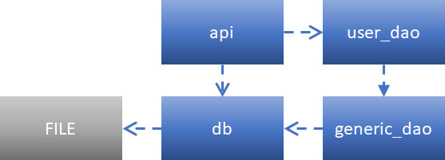

**Program Function:** Umba’s test is to use the Github’s API to populate a database with GitHub users and display that information in a dynamic table.  
**Assignment URL:** https://www.notion.so/umba/Python-Homework-299de2adbd144aa7ae09c828b1df08ff  

**Programmer:** Brian Kelly (brian@vitalcare.us)  
**Languages:** Python 3.7, HTML 5  
**Additional libraries:** Flask 1.1.2, requests 2.25.1, datatables 1.10.23, JQuery 3.5.1  
**Estimated development time:** 16 hours

#Programming Approach  
At a high-level, the application uses a MVC architectural pattern for ease of comprehension and encapsulation. Since the view never needs to call the controller to initiate changes, both the view and the controller only communicate with the model (Figure 1). While an enterprise-class program would have separated these components into different packages, I left them combined as the view and controller are contained in only one file each.

*Figure 1. Partial MVC architectural pattern.*

The model handles sorts and returns only the subset of data requested by the view, ensuring that clients remain responsive for large datasets. It could be easily expanded to include other parameters like search terms or multi-column sorts. Avatar images are left to the client to request so the table renders quickly. While I can optimize this further, this program emphasizes clean and readable code which is important when working in a group.

##View  
The view is composed only of one file, index.html. This runs on the client side using Javascript with JQuery. For efficiency and to promote reusability, I used an open-source table implementation, DataTables, as its license allows corporate use.

##Model  
The bulk of the program is the model. I designed the model as an object-oriented microservice to highlight my architectural style. The model is extensible as common functionality resides in a generic database object which could be subclassed if new tables are added to the database. The flexibility of the design allows me to use the same classes for unit tests.

Figure 2 shows the model interactions.

*Figure 2. Model components and interactions.*

The model classes include:
-	**db.py** is an abstraction of an SQLite database, created with a particular file name which creates different databases to store records (e.g., production and unittest).

-	**generic_dao.py** is an abstraction of a database table, containing the general functionality needed (e.g., record reading and creation).

-	**user_dao.py** is an implementation of GenericDao, representing the user table. It includes information about the table structure and table-specific CRUD operations.

-	**api.py** contains the REST API information using the Flask framework. It passes the db object to the user_dao to read user records and returns a JSON with the information stored in the database. To keep the project simple, this interface doubles as the server for HTML and image files to clients.

The model does not have a true CRUD REST API due to time and scope of the test. It only provides a custom-tailored API for the data table library.

##Controller  
The controller is only one file, seed.py that reads user information from the GitHub API and passes it to the model. While this would normally be done through a CRUD REST API, I call create_user() in UserDao directly to keep the project simple. In addition, user data is transferred with a Python data structure instead of dedicated DTOs.

#Next Steps  
Next steps to develop this as a commercial product:
- Create tests for Flask routes
- HTML and PNG files should be served by a dedicated web server
- Move the view and controller pieces into their own packages
- Add full CRUD functionality to the GenericDao class
- api.py includes REST API functions calling the GenericDao CRUD methods
- seed.py uses the new REST API instead of a function call
- Add better use and handling of Exceptions
- Convert the GenericDao column_types attribute to an enumeration
